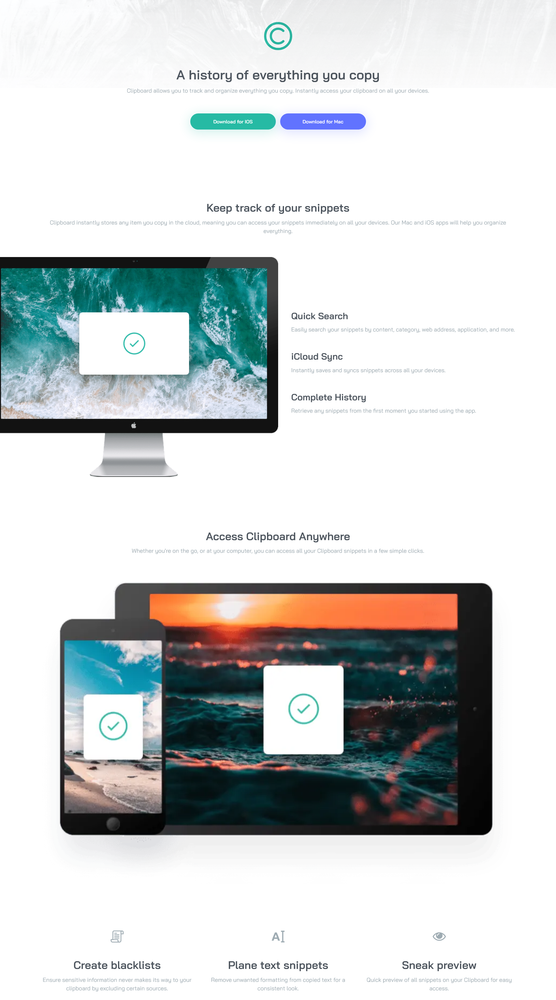

# Frontend Mentor - Clipboard landing page solution

This is a solution to the [Clipboard landing page challenge on Frontend Mentor](https://www.frontendmentor.io/challenges/clipboard-landing-page-5cc9bccd6c4c91111378ecb9). Frontend Mentor challenges help you improve your coding skills by building realistic projects.

## Table of contents

- [Overview](#overview)
  - [The challenge](#the-challenge)
  - [Screenshot](#screenshot)
  - [Links](#links)
- [My process](#my-process)
  - [Built with](#built-with)
  - [Continued development](#continued-development)
  - [Useful resources](#useful-resources)
- [Author](#author)

**Note: Delete this note and update the table of contents based on what sections you keep.**

## Overview

### The challenge

Users should be able to:

- View the optimal layout for the site depending on their device's screen size
- See hover states for all interactive elements on the page

### Screenshot

### Links

- Solution URL: [Add solution URL here](https://github.com/samimkabiru/clipboard.git)
- Live Site URL: [Add live site URL ](https://copybin.vercel.app/)

## My process

- I buit this website using the mobile-first approach.
- I divided the style sheet into logical sections.
- I also built the website using the bottom-up aproach.

### Built with

- Semantic HTML5 markup
- CSS custom properties
- Flexbox
- CSS Grid
- Mobile-first workflow

### Continued development

- I intend to focus on practicing more projects that require grid layout.
- My foundation isn't solid on the css box model as well so I intend to practice it more.

### Useful resources

- [Cloud convert](https://cloudconvert.com/) - cloud convert is an online tool that can be use to convert images from one format to another. It really came to my aid because I couldn't purchase an adobe photoshop plan. I recommend it for any one who doesn't have money to pay for adobe photoshop.

- [Responsive breakpoints](https://responsivebreakpoints.com/) - This is an amazing online resizer which helped me resize images. Highly recommended.

## Author

- Website - [samim kabiru](https://copybin.vercel.app/)
- Frontend Mentor - [@samimkabiru](https://www.frontendmentor.io/profile/samimkabiru)
